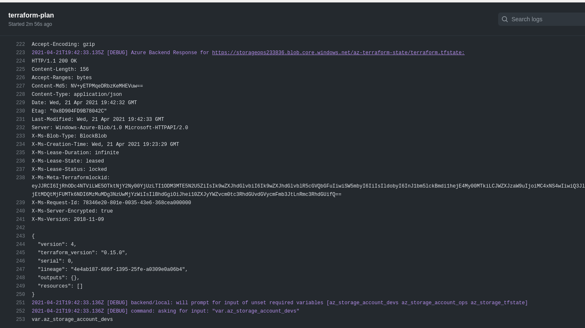

# TODO

- [x] - share one azure storage account with other github projects, but use different blobs
- [ ] - add demo with packer: 
  - [Creating a minimal OS for containers with LinuxKit and Azure](https://stevenfollis.com/2020/04/17/creating-a-minimal-os-for-containers-with-linuxkit-and-azure/) 
  - [linuxkit/linuxkit](https://github.com/linuxkit/linuxkit/blob/master/docs/platform-azure.md) 
  - [Azure/WALinuxAgent](https://github.com/Azure/WALinuxAgent) 
  - [[BUG] NameError: name `distro` is not defined on Alpine 3.11 · Issue #1753 · Azure/WALinuxAgent](https://github.com/Azure/WALinuxAgent/issues/1753#issuecomment-577371445) 
  - [Docker Hub](https://hub.docker.com/r/nathanleclaire/walinuxagent/dockerfile) 
  - [Packer &#43; Ansible - Dockerfile = AwesomeContainer](https://alex.dzyoba.com/blog/packer-for-docker/) 
  - [Azure chroot - Builders | Packer by HashiCorp](https://www.packer.io/docs/builders/azure/chroot)
  - [artis3n/cloud-hackbox](https://github.com/artis3n/cloud-hackbox/tree/c6a1f95db038d427f14054258257fa448eff0546)
  - [True CI/CD Pipeline for &quot;Golden Image&quot; AMIs](https://dev.to/artis3n/true-ci-cd-pipeline-for-golden-image-amis-4p39)
  - [cisagov/skeleton-packer](https://github.com/cisagov/skeleton-packer)
  - [Building Docker image with Packer and provisioning with Ansible](https://gist.github.com/maxivak/2d014f591fc8b7c39d484ac8d17f2a55)
  - [Automated image builds with Jenkins, Packer, and Kubernetes](https://cloud.google.com/architecture/automated-build-images-with-jenkins-kubernetes)
  - [How are docker and packer different? And which one should I prefer when provisioning images?](https://stackoverflow.com/questions/47169353/how-are-docker-and-packer-different-and-which-one-should-i-prefer-when-provisio)
- [ ] - docker-compose on azure VMs 
    - [Huachao/azure-content](https://github.com/Huachao/azure-content/blob/master/articles/virtual-machines/virtual-machines-docker-compose-quickstart.md#get-started-with-docker-and-compose-to-define-and-run-a-multi-container-application-on-an-azure-virtual-machine)
    - [Use Docker Compose to deploy multiple containers - Azure Cognitive Services](https://docs.microsoft.com/en-us/azure/cognitive-services/containers/docker-compose-recipe)
    - [How do I deploy my docker-compose project using Terraform?](https://stackoverflow.com/questions/47983827/how-do-i-deploy-my-docker-compose-project-using-terraform)

# Deployment steps

> Note: terraform for azure will not work before doing `make setup-deployments; make submit-deployments` or simply `make all`. As such github actions will fail as they need secrets!

## Setup deployments

In here we create Azure RBAC, install terraform locally, setup resources in Azure for Terraform. 

```sh
make setup-deployments
```

## Submit Deployments

In here we update dynamic variables for terraform via bash (edit deployments-submit/02.make.terraform.tfvars.sh accordingly), test our terraform deployment locally, and push changes of repo to github.

```sh
make submit-deployments
```

In github 


# Issues

## Parallel access to same azure blob 

Each github workflow using storage blob should have its own blob as they try to lock the same blob


## Manually unlock terraform.tfstate blob in azure

```sh
isLocked=$(az storage blob show --name "terraform.tfstate"  --container-name az-terraform-state --account-name storageops233836 --query "properties.lease.status=='locked'" -o tsv)
 
if  $isLocked; then 
    az storage blob lease break --blob-name "terraform.tfstate" --container-name az-terraform-state --account-name storageops233836                
fi      
```


## terraform plan hangs in github actions



As we can here `command: asking for input: "var.az_storage_account_devs"` there are no variables, so we have to unignore `terraform.tfvars` file. LOL

## terraform plan is locked

When we try `terraform plan`


and in azure portal we see


or in az cli we can do

```sh
az storage blob show --name "terraform.tfstate" --container-name ${AZURE_STORAGE_TFSTATE} --account-name ${AZURE_STORAGE_ACCOUNT_OPS}  
```

to see 


Then we can break lease of blob in azure

```sh
az storage blob show --name "terraform.tfstate" --container-name ${AZURE_STORAGE_TFSTATE} --account-name ${AZURE_STORAGE_ACCOUNT_OPS}
```